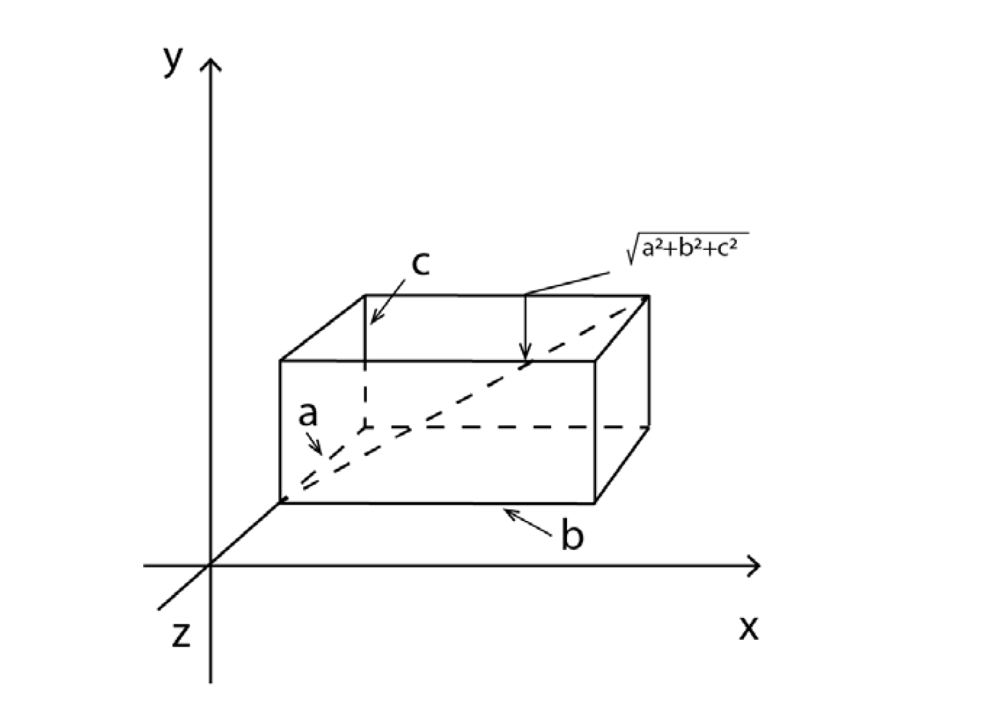
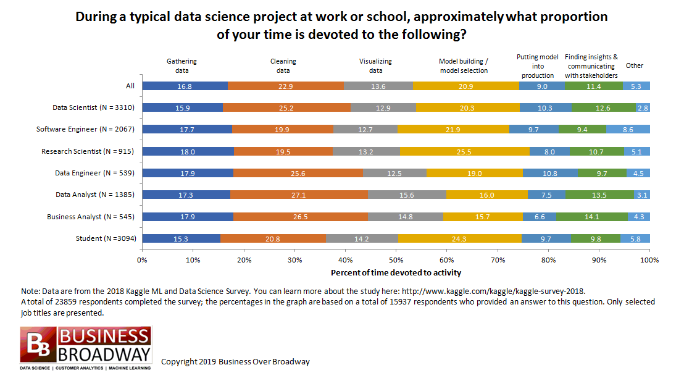

```{r setup, include=FALSE}

# deletes all objects from the environment
rm(list=ls())

knitr::opts_chunk$set(echo = FALSE)

knitr::opts_chunk$set(dev = 'pdf')


library(tidyverse)
library(tufte)
library(here)

source("./code/@@@_functions.R")

source(here("08_Unsupervised_Learning","code","create_plots_kmeans.R"))

```

# Goals of this lecture

* Understand the difference between unsupervised- and supervised learning

* Understand the definition of hard clustering

* Understand clustering cost from different similarity measures

* Understand the K-means algorithm

* Understand the K-medeoids algorithm

# Some notation

Feature vectors $x$, labels $y$
\begin{align*}
x \in \mathbb{R}^d\\
y \in \{-1,1\}
\end{align*}
Training set
\begin{align*}
S_n = \{(x^{(i)}, y^{(i)}), i=1,...,n\}
\end{align*}

Classifier
\begin{align*}
h: \mathbb{R}^d \rightarrow \{-1,1\}
\end{align*}

<!-- \chi^{+} = \{x \in \mathbb{R}^d: h(x) =1\}\\ -->
<!-- \chi^{-} = \{x \in \mathbb{R}^d: h(x) =-1\} -->
<!-- \end{align*} -->

<!-- Training error -->
<!-- \begin{align*} -->
<!-- \varepsilon_n(h)= \frac{1}{n} \sum_{i=1}^n \textbf{1}\{h(x^{(i)}) \neq y^{(i)} \} -->
<!-- \end{align*} -->

<!-- Test error (over disjoint set of examples) -->

<!-- \begin{align*} -->
<!-- \varepsilon(h) -->
<!-- \end{align*} -->

<!-- Set of classifiers -->
<!-- \begin{align*} -->
<!-- h \in H -->
<!-- \end{align*} -->

# Supervised Learning vs. Unsupervised Learning

* In supervised learning we have labeled data: $S_n = \{(x^{(i)}, y^{(i)}), i=1,...,n\}$ and want to learn to correctly classify unseen data 
   + Think of: 
   + A gazillion of photos with a "cat" and "not cat" classification.
   + etc.

* In clustering we only have feature vectors: $S_n = \{x^{(i)}|i=1,\cdots,n\}$ and want to find structures in unlabeled data
   + Think of: 
   + Clustering a data set of customer into groups
   + Find spatial patterns, e.g. crime hotspots
   + Find similar news stories
   + Recommend products to customers "like you"
   + Create labels for supervised learning algorithms
   + Exploratory data analysis
   
* Types
   * Hard clustering
   * Soft clustering
   * Hierarchical clustering


## Clustering as Partitioning

Clustering input: $S_n = \{x^{(i)}|i=1,\cdots,n\}, K$

Number of clusters: $K$

The output of the clustering algorithm are indexes that partition the data: $C_1,\cdots,C_k$; where $C_1 \cup C_2 \cup ... \cup C_ K = \big \{  1, 2, ..., n \big \}$ and $C_ i \cap C_ j = \emptyset$ {for any $i \neq j$ in $\{ 1, ..., k\}$.

In other words: the union of all  $C_j$ 's is the original set and the intersection of any  $C_i$  and  $C_j$  is an empty set.

### In plain English: 

We want to assign each element of the training data set $S_n$ into $K$ separate clusters in a way that each element only belongs to one cluster.

# Clustering as selecting representatives

Clustering input: $S_n = \{x^{(i)}|n=1,\cdots,n\}, K$

Number of clusters: $K$

Select the best representatives of each cluster: $z^{(1)},\cdots,z^{(k)}$.

## Similarity Measures-Cost functions

* Cost of partitioning 
  + Sum of costs of all individual clusters: $cost(C_1,\cdots,C_k) \sum_{j=1}^k cost (C_j)$. 

* Cost of a single cluster 
  + Sum of distances from data points to the representative of the cluster: $Cost(C,z) = \sum_{i \in C} distance(x^{(i)},z)$
  
* Total Cost to be minimized
   + $\text {Cost}(C_1, ..., C_ K) = \sum _{j=1}^{K} \text {Cost}(C_ j) = \sum _{j=1}^{K} \sum _{i \in C_ j} \| x_ i - z_ j\| ^2$

### Two common distance measures

* Cosine similarity: $cos(x^{(i)},x^{(j)}) = \frac{x^{(i)} \cdot x^{(j)}}{||x^{(i)}|| ||x^{(j)}||}$ 
   + Is not sensitive of magnitude of vector (will not react to length).

* Euclidean squared distance: $dist^2(x^{(i)},x^{(j)})= ||x^{(i)}-x^{(j)}||^2$.
   + Will react to length of the vectors

## Euclidean Distance and Euclidean Squared Distance

```{r, echo=FALSE, out.width="35%", fig.align="center"}

```

* The Euclidean distance between any two points is the square root of the sum
of squares of differences between the coordinates. Straight line distance between any two points (pythagorean theorem)
* In two dimensions: $dist(p,q) = \sqrt{(p_1-q_1)^2 + (p_2 - q_2)^2}$. 
* Squared Euclidean distance is the sum of squares: $dist^2(p,q) = (p_1-q_1)^2 + (p_2 - q_2)^2$
* Generalizes to n-dimensions but looses meaning in very high dimensional data


## Cosine distance and Cosine similarity

```{r, echo=FALSE, out.width="50%", fig.align="center"}
knitr::include_graphics("./art/cosine_distance.PNG")
```

* Cosine similarity between any two points is defined as the cosine of the angle between any two points with the origin as its vertex.
* Cosine distance is defined as: 1 - cosine similarity
* Cosine distance varies from 0 to 2, whereas cosine similarity varies between -1 to 1.

# K-Means

## Iris Dataset

```{r, echo=F, out.width="80%", fig.align="center"}

iris %>%
   ggplot() +
   aes(x=Sepal.Length, y=Sepal.Width, color = Species) +
   geom_point() +
   theme_bw()


```

## Assign random initialization points (representatives $z_j$)

```{r, echo=F, out.width="80%", fig.align="center"}


print(initial)


```


## Calculate nearest points to representatives $z_j$ (1st round)

```{r, echo=F, out.width="80%", fig.align="center"}

print(distance[[1]])


```


## Recalculate representatives $z_j$ as centroids of the new cluster (1st round)


```{r, echo=F, out.width="80%", fig.align="center"}

print(plots[[1]])


```


## Calculate nearest points to representatives $z_j$ (2nd round)

```{r, echo=F, out.width="80%", fig.align="center"}

print(distance[[2]])


```


## Recalculate representatives $z_j$ as centroids of the new cluster (2nd round)


```{r, echo=F, out.width="80%", fig.align="center"}

print(plots[[2]])


```


# K-means Algorithm

Given a set of feature vectors $S_ n = \big \{ x^{(i)}| i = 1,...,n\big \}$ and the number of clusters  $K$ we can find cluster assignments  $C_1,\cdots,C_K$ and the representatives of each of the $K$ clusters $z_1,\cdots,z_K$:


\begin{enumerate}
   \item Randomly select $z_1,\cdots,z_K$
   \item Iterate until no change in cost
      \begin{enumerate}
         \item Given $z_1,\cdots,z_K$, assign each data point $x^{(i)}$ to the closest $z_j$, such that $\text {Cost}(z_1, ... z_ K) = \sum _{i=1}^{n} \min _{j=1,...,K} \left\|  x^{(i)} - z_ j \right\| ^2$
         \item Given $C_1,\cdots,C_K$ find the best representatives $z_1,\cdots,z_K$, i.e. find $z_1,\cdots,z_K$ such that $\displaystyle z_ j=\operatorname {argmin}_{z} \sum _{i \in C_ j} \| x^{(i)} - z \| ^2$
   \end{enumerate}
\end{enumerate}

## Minimizing the cost in K-means

K-means only works with Euclidean square distance!

The best representative is found by optimization (gradient with respect to $z^{(j)}$, setting to zero and solving for $z^{(j)}$). 

$\nabla _{z_ j}\left(\sum _{i \in \mathbb {C}_ j} \| x^{(i)} - z_ j\| ^2\right) = 0$

$\sum _{i \in \mathbb {C}_ j} -2(x^{(i)} - z_ j) = 0$

$z^{(j)}=\displaystyle \frac{\sum _{i \in C_ j} x^{(i)}}{|C_ j|}$

It is the centroid of the cluster, where $|C_ j|$ is the size of the respective cluster.

The clustering output that the K-Means algorithm converges to depends on the intialization! Suboptimal initializations are possible.


# K-means in pseudo code for two clusters

\begin{enumerate}
   \item Choose any two random coordinates, $z_1$ and $z_2$, on the scatter plot as initial
   cluster centers.

   \item Calculate the distance of each data point in the scatter plot from coordinates $z_1$
   and $z_2$
   \item Assign each data point to a cluster based on whether it is closer to $z_1$ or $z_2$
   \item Find the mean coordinates of all points in each cluster and update the values of $z_1$
   and $z_2$ to those coordinates respectively.
   \item Start again from Step 2 until the coordinates of $z_1$ and $z_2$ stop moving significantly,
   or after a certain pre-determined number of iterations of the process.
\end{enumerate}

## Limitations of the K-Means Algorithm

* Algorithm is only guaranteed to converge to local minimum
* Initialization matters
   + Bad initalization can lead to suboptimal clusters in pathological cases
* Unlclear how many cluster we should plug into the algo (more about that next lecture)
* Only works with eucledian distance

# K-Medoids

Any distance measure possible!

Gives actual data points as representatives.

Finds the cost-minimizing representatives  $z_1,\cdots,z_K$ for any distance measure. Uses real data points for initialization.

\begin{enumerate}
\item Randomly select $\big \{  z_1, ..., z_ K \big \}  \subseteq \big \{  x_1, ..., x_ n \big \}$
\item Iterate until no change in cost
\begin{enumerate}
\item Given $z_1,\cdots,z_K$, assign each data point $x^{(i)}$ to the closest $z_j$, so that $\text {Cost}(z_1, ... z_ K) = \sum _{i=1}^{n} \min _{j=1,...,K} \left\|  x^{(i)} - z_ j \right\| ^2$
\item Given $C_ j \in \big \{ C_1,...,C_ K\big \}$ find the best representative $z_ j \in \big \{ x_1,...,x_ n\big \}$ such that $\sum _{x^{(i)} \in C_ j} \text {dist}(x^{(i)}, z_ j)$ is minimal
\end{enumerate}
\end{enumerate}

# K-Mediods pseudocode

1. Choose k data points from the scatter plot as starting points for cluster centers.
2. Calculate their distance from all the points in the scatter plot.
3. Classify each point into the cluster whose center it is closest to.
4. Select a new point in each cluster that minimizes the sum of distances of all points
in that cluster from itself.
5. Repeat Step 2 until the centers stop changing.

# Literature

<!-- ```{r, echo=FALSE, out.width="30%", fig.cap="Listen to Yoda, he's been doing this for ages"} -->
<!--  -->
<!-- ``` -->


<!-- ## How do data scientist spend their time? -->

<!--  -->


<!-- ## Gathering Data for social science research I -->


<!-- * Public Databases by offical actors: -->
<!--   + Eurostat, Fred, Worldbank, Open Data, etc. -->
<!--   + Files in various formats (txt, excel, csv, stata, spss, raster files, etc.). -->
<!--   + Data access via an API, mostly json format. -->

<!-- * Public Databases by private actors and NGOs: -->
<!--   + Facebook movement data, World Pop, etc. -->
<!--   + Files in various formats (txt, excel, csv, stata, spss, raster files, etc.). -->
<!--   + Data access via an API, mostly json format. -->

<!-- * Closed Data/Microdata by governmental agencies, statistical bureaus, etc.: -->
<!--   + Complicated "vetting" procedure. -->
<!--   + Scientific use files in various formats (txt, excel, csv, stata, spss, etc.). -->
<!--   + Unstructured data -->
<!--   + Data "hidden" in databases -->
<!--   + access sometimes only allowed "on location". -->

<!-- ## Gathering Data for social science research II -->

<!-- * Data used/provided by academic publications in various formats (excel, csv, stata, spss, etc.) -->
<!--   + [Harvard Dataverse](https://dataverse.harvard.edu/), [Nature Scientific Data](https://www.nature.com/sdata/), [Academic Torrents](https://academictorrents.com/), etc. -->

<!-- * Private Data providers -->
<!--   + Cooperation with companies, Platforms like Kaggle, etc. -->
<!--   + Company data is often "hidden" inside databases. -->
<!--   + Files in various formats (txt, excel, csv, stata, spss, raster files, etc.). -->
<!--   + Data access via an API, mostly json format. -->

<!-- * Gathering your own data -->
<!--   + Experiments -->
<!--   + Surveys -->
<!--   + Webscraping, API access, Google Analytics, etc. -->


<!-- ## So now that you've got your data... What next? -->

<!-- ```{r, echo=FALSE, out.width="50%", fig.cap="A nice image about the pain we are about to face"} -->
<!--  -->
<!-- ``` -->

<!-- ## The data wrangling process starts -->

<!-- ```{r, echo=FALSE, out.width="50%", fig.cap="Phases of a typical data science project (R for data science)"} -->
<!-- knitr::include_graphics("./art/data-science-wrangle.png") -->
<!-- ``` -->

<!-- * How to read the data in? -->
<!-- * Data is spread across multiple files and sources. -->
<!-- * Variable definitions aren't clean/consistent. -->
<!-- * The data isn't displayed correctly. -->
<!-- * You have to create variables, you have to transform variables, you have to aggregate variables. -->
<!-- * You have to bring the data into the format the packages actually needs. -->

<!-- ## Sounds pretty awful but in reality: -->

<!-- ### We all use Google -->
<!-- 1. Learning this can be fun! -->
<!-- 2. It is easy once you've learned the basics -->
<!-- 3. Stack Exchange and Google are your friends (almost every problem already ocurred) -->

<!-- ```{r, echo=FALSE, out.width="30%",fig.align="center"} -->
<!--  -->
<!-- ``` -->

<!-- ## The main ressource for this part of the course is -->

<!-- ```{r, echo=FALSE, out.width="30%", fig.cap="Get it for free at: https://r4ds.had.co.nz/"} -->
<!-- knitr::include_graphics("./art/r4datascience_cover.png") -->
<!-- ``` -->

<!-- ## In this course we are focusing on the tidyverse for doing this stuff -->

<!-- ```{r, echo=FALSE, out.width="30%", fig.cap="A great collection of R-packages maintained by the guys/gals from R-studio"} -->
<!-- knitr::include_graphics("./art/hex-tidyverse.png") -->
<!-- ``` -->

<!-- ## Tidyverse or not? -->

<!-- "The tidyverse is an opinionated collection of R packages designed for data science. All packages share an underlying design philosophy, grammar, and data structures."  -->

<!-- [www.tidyverse.org](https://www.tidyverse.org/) -->

<!-- * Succint and readable synthax which is important for reproducible research and collaborations -->
<!-- * Great for small data sets handled inside RAM (a few hundred Megabytes to 1-2 Gb) -->
<!-- * Best plotting package out there (imo) -->
<!-- * Maintained by R-Studio and Hadley Wickham -->
<!-- * Big community and a lot of documentation/information -->
<!-- * Connectors to SQL, data.table, spark and hadoop -->


<!-- ### For big(ish) data other tools are better suited: -->

<!-- * data.table package -->
<!-- * Databases like PostgreSQL or MySQL -->
<!-- * Clustering solutions like Spark, Hadoop, etc. -->


